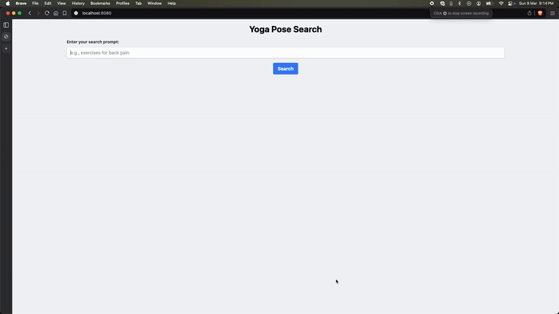

# Yoga Pose Recommender: AI-Powered Vector Search for Yoga Poses
An AI-powered semantic search system that helps users explore yoga poses. By leveraging Gemini (LLM) to generate rich, context-aware descriptions and create high-dimensional vector embeddings, the project transforms an existing Hugging Face dataset into a deeply intelligent and intuitive search experience. With LangChain JS orchestrating data processing and Firestore serving as a high-performance vector database, users can retrieve the most relevant yoga poses through natural language queries. Additionally, Google Cloud’s Text-to-Speech technology enhances accessibility by providing immersive audio descriptions. Built with Node.js, this system seamlessly integrates AI-driven search, vector embeddings, and real-time query processing to redefine yoga exploration.


This application does the following:
1. Utilize an existing [Hugging Face Dataset](https://huggingface.co/datasets/omergoshen/yoga_poses) of Yoga poses (JSON format).
2. Enhanced the dataset with an additional field `description` that uses Gemini(LLM) to generate descriptions for each of the poses.
3. Use Text Embeddings Model to create Vector Embeddings
4. Use LangChain JS to create a Document and Firestore API to create the collection in Firestore.
5. Create a composite index in Firestore to allow for Vector search.
6. Utilize the Vector Search in a Node.js Application that brings everything together as shown below:



## Technologies used:
1. JavaScript + Node.js Framework
2. Google Cloud : 
    -   Firestore for storing Vector Embeddings
    -   Gemini(LLM) for creating Vector Embeddings and generating Yoga Pose descriptions
    -   Text-to-Speech for playing audio description.
3. LangChain JS framework

## Instructions

- Set up the environment variables. Go to `env-template` and edit the variables. Please update the values for `PROJECT_ID` and `LOCATION` as per what you have selected while creating the Google Cloud Project and Firestore Database region. Ideally, we would like the values of the `LOCATION` to be the same for the Google Cloud Project and the Firestore Database, for e.g. `us-central1`. Please save this file as `.env` in the same folder as the env-template file.

- Navigate to the root folder of the repository that you cloned via the following command:
    ```
    cd yoga-poses-recommender-nodejs
    ```

- Install the Node.js dependencies via the command:
    ```
    npm install
    ```
- Firestore Database initialization:
    - Navigate to [Firestore Database Console](https://console.cloud.google.com/firestore) and create the `default` database by clicking on `Create Database`. During creation of the database, go with the following values:
        - Firestore mode: Native.
        - Location: Go with the default location settings.
        - For the Security Rules, go with Test rules.
        - Create the Database.

- We have downloaded open source data for Yoga Poses from [Hugging Face Dataset](https://huggingface.co/datasets/omergoshen/yoga_poses) that is present in `data/yoga_poses.json`. But this doesn't help in search since there is less textual context. So we generate the descriptions for each pose using Gemini, the Large Language Model.
    ```
    npm run generate-descriptions
    ```
    This will run `generate-descriptions.js` script, and the data is saved in `data/yoga_poses_with_descriptions.json`.

- Import Data into Firestore and generate Vector Embeddings:
    - Run
        ```
        npm run import-data
        ```
        This will convert the list of JSON objects into Firestore Documents. Each document will have two attributes: content and metadata. The metadata object will contain the entire JSON object that has attributes like name, description, sanskrit_name, etc. The content will be a string text that will be a concatenation of a few fields.
        
        Then we will be using the Vertex AI Embeddings class to generate the embedding for the content field. This embedding will be added to each document record and then we will use Firestore API to save this list of document objects in the collection.
    
    - Create index to perform vector search efficiently
        ```
        gcloud firestore indexes composite create --project=<YOUR_PROJECT_ID> --collection-group=poses --query-scope=COLLECTION --field-config=vector-config='{"dimension":"768","flat": "{}"}',field-path=embedding
        ```
- Run the app locally:
    - Setup Google Cloud credentials
        ```
        export GOOGLE_APPLICATION_CREDENTIALS="path/to/your/keys/file.json"
        ```
    - Start the app
        ```
        npm run start
        ```
    - Go to [localhost:8080](localhost:8080)